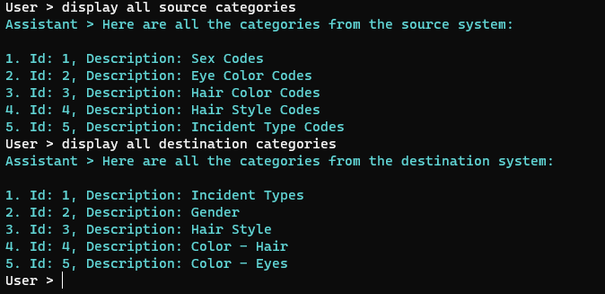

# Code Mapper - A Semantic Kernel Hackathon Project

Code Mapper is an application that uses artificial intelligence to map list of lookup codes from two separate systems.
Such mappings are often needed when integrating systems or migrating data from a system to another.

The mapping of codes is often a very laborious and error prone work, and lists of codes might have thousand of entries that needs human attention and require hours, if not days, to complete. 
Data exchange between systems often cannot commence until the mapping is complete, and this can cause delays in the implementation of new systems or the migration of existing ones.

---

Code Mapper was built for the second Semantic Kernel Hackathon with the following goals in mind:

1. To create a tool that shows how SK can be used to solve real-world IT problems.    
1. To create a Semantic Kernel plugin to helps with the mapping process.
1. To experiment with a large prompt and the new SK planners.
1. To have fun! :smiley:

*Note: CM was built using data inspired by the law enforcement domain, but it can be used in any domain (e.gh. healthcare, warehousing, etc.).**

## Why Code Mapper?

Imagine you need to integrate two systems (source and destination) that use different codes to identify the same things.

For instance, imagine categories of codes such as 'Eye Color Codes', 'Hair Color Codes', etc.
Everytime an insert or an update occurrs in the source system, the destination system needs to be notified and updated accordingly, but the values of the lookup codes will likely be different.

The source system might have categories such as'Eye Color Codes' (CategoryId=2) and 'Sex Codes' (CategoryId=1):

| Id  | CategoryId | CategoryDescription | Code | Description             |
| --- | ---------- | ------------------- | ---- | ----------------------- |
| 4   | 2          | Eye Color Codes     | BLU  | Blue                    |
| 5   | 2          | Eye Color Codes     | BRO  | Brown                   |
| 6   | 2          | Eye Color Codes     | GRN  | Green                   |
| 7   | 2          | Eye Color Codes     | GRY  | Grey                    |
| 8   | 2          | Eye Color Codes     | He has light red eyes  | He has light red eyes   |
| 9   | 2          | Eye Color Codes     | HAZ  | Hazel                   |
| 10  | 2          | Eye Color Codes     | H    | Haz                     |
| 11  | 2          | Eye Color Codes     | PNK  | Pink                    |
| 12  | 2          | Eye Color Codes     | P    | P                       |
| 13  | 2          | Eye Color Codes     | B    | B                       |
| 1   | 1          | Sex Codes           | F    | Female      |
| 2   | 1          | Sex Codes           | M    | Male        |

The destination system has instead a category 'Color - Eyes' (Id=5) with the following values:

| Id  | CategoryId | CategoryDescription | Code | Description    |
| --- | ---------- | ------------------- | ---- | --------------- |
| 125 | 5          | Color - Eyes        | BLK  | BLACK           |
| 126 | 5          | Color - Eyes        | BLU  | BLUE            |
| 127 | 5          | Color - Eyes        | BRO  | BROWN           |
| 128 | 5          | Color - Eyes        | GRN  | GREEN           |
| 129 | 5          | Color - Eyes        | GRY  | GRAY            |
| 130 | 5          | Color - Eyes        | HAZ  | HAZEL           |
| 131 | 5          | Color - Eyes        | MAR  | MAROON          |
| 132 | 5          | Color - Eyes        | MUL  | MULTICOLORED    |
| 133 | 5          | Color - Eyes        | PNK  | PINK            |
| 134 | 5          | Color - Eyes        | XXX  | UNKNOWN         |
| 78  | 2          | Gender              | F    | Subject's gender reported as female         |
| 79  | 2          | Gender              | G    | Occupation or charge indicated "Male Impersonator"  |
| 80  | 2          | Gender              | M    | Subject's gender reported as male           |
| 81  | 2          | Gender              | N    | Occupation or charge indicated "Female Impersonator" or transvestite |
| 82  | 2          | Gender              | X    | Unknown gender                              |
| 83  | 2          | Gender              | Y    | Male name, no gender given                  |
| 84  | 2          | Gender              | Z    | Female name, no gender given                |

In order to integrate the two systems, the codes in the source system need to be mapped to the codes in the destination system.

## Challenges
1. How do we automatically match the codes in the source system to the codes in the destination system?
    1. The match is fairly easy when the **codes** have the same code and/or descriptions 
        1. ```Eye Color Codes/BLU/Blue``` matches the destination code ```Color Eyes/BLU/BLUE```.    
    1. Other matches such as the **category** are not so obvious:
          1. How did we match ```Eye Color Codes``` to ```Color Eyes```?
1. What about more complicated cases like ```Sex Code/F/Female``` to ```Gender/F/Subject's gender reported as female```
    1. While the code 'F' is the same, the descriptions are wildly different.     
    1. What if the mapping were ```Sex Code/F/Female``` to ```Gender/2311/Subject's gender reported as female```? 
        1. How do we match codes that have nothing in common, except **semantically**?

Code Mapper uses a combination of machine learning and natural language processing to facilitate the mapping of codes.

## How does it work?

In order to map codes, we need the following:

1. The Semantic Kernel plugin [CodeMapperPlugin](/src/FreeMindLabs.SemanticKernel.Plugins.CodeMapper/CodeMapperPlugin.cs) that:
    1. Can load data from CSV files
    1. Can extract categories and codes from such files with some filtering options
        1. The files containing codes could be very large and will likely overflow the maximum amount of tokens we can use in a prompt.
        
1. A [prompt](ConsoleCodeMapper/FirstPrompt.md) that explains how to map codes and that includes sample data.
    1. The prompt is written in Markdown, so it can be easily edited and viewed.
      
1. Data to map:
    1. The user prepares two CSV files containing the source codes and destination codes.
        1. These files need to be placed in the ```\Data``` subfolder, for the app to have access to them.
            1. Check [SourceCodes.csv](/ConsoleCodeMapper/Data/SourceCodes.csv) to see all the codes in the source system.
            1. Check [DestinationCodes.csv](/ConsoleCodeMapper/Data/DestinationCodes.csv) to see all the codes in the destination system.            

### Configuration

To launch Code Mapper, we need an Open AI API Key in user secrets.
If you look at the appSettings.json file, you will see the following:

```
{
  "OpenAI": {
    "ApiKey": "...secrets...",
    "EmbeddingModelId": "text-embedding-ada-002",
    "CompletionModelId": "text-davinci-003",
    "ChatModelId": "gpt-4"    
  }
}
```

Enter the value of your OpenAI ApiKey in user secrets by running the following command:
```
dotnet user-secrets set "OpenAI:ApiKey" "12345"
```

Once you do that, the secrets.json file of the project will look like this:
```
{
  "OpenAI:ApiKey": "sk-xxxw8OIAPzrXRxxxxxxxxxlbkFJIBrvsAQE8xxxx"  
}
```


## Running Code Mapper

### Startup
Once Code Mapper starts, the initial [code mapping prompt](ConsoleCodeMapper/FirstPrompt.md) will be sent to the application (green) which will then explain its plan for mapping codes (cyan).


### Load and display the codes

We can run the commands ```display all source categories``` and ```display all destination categories``` to see the categories of codes in the source and destination systems.

These commands make use of the methods of the [CodeMapperPlugin](/src/FreeMindLabs.SemanticKernel.Plugins.CodeMapper/CodeMapperPlugin.cs) to load the codes from the CSV files and display them in a table.



### Get the ids of categories

We can get the id of a category by searching by its description.
```What is the id of the source category with description 'Sex Codes'?```


### Do the mapping of codes

Mapping codes is as simple as sending a command like:
``` Map the codes the source category with description 'Sex Codes'```


### Reverse mappings

We can also do reverse mappings, by starting from the description in the destination. This took a little bit more typing, but it worked.


### Additional commands to try

| Command             |
| ------------------- |
| What is the id of the source category with description 'Sex Codes'? |
| Map the codes the source category with description 'Sex Codes' |
| What is the description of the source category 'Hair Color Codes'? |
| Map the codes the source category with description 'Hair Style Codes' | 
| Map the codes the source category with description 'Hair Style Codes' |
| Map the codes the source category with description 'Eye Color Codes' |

### Contact Info

**Name:** Alessandro Federici
**Company:** Free Mind Labs, inc.
**Email:** alef@freemindlabs.com