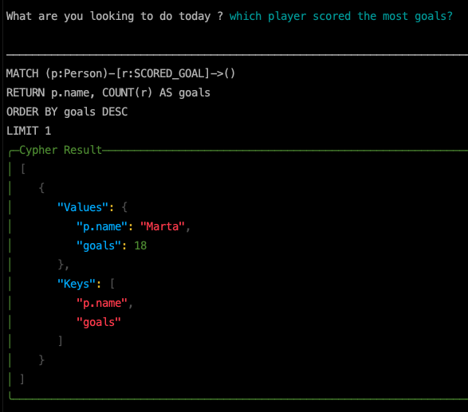
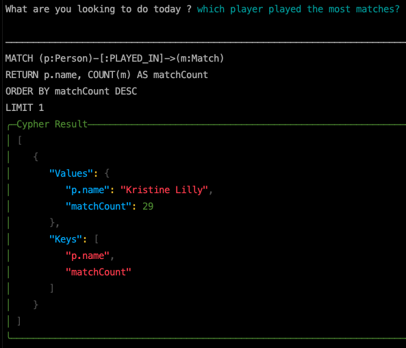
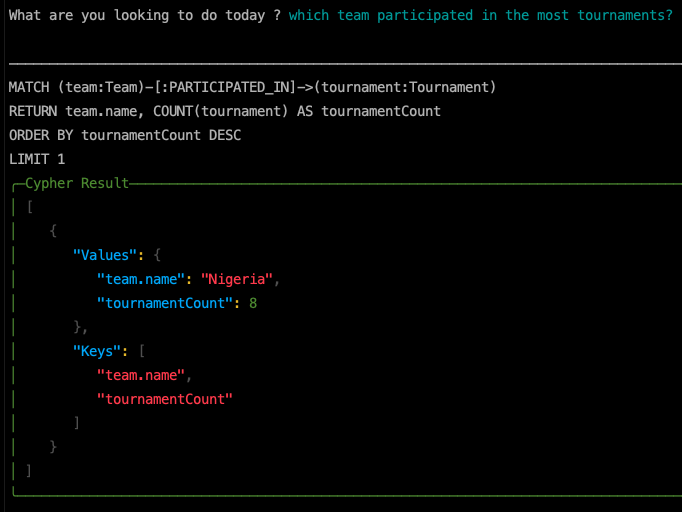
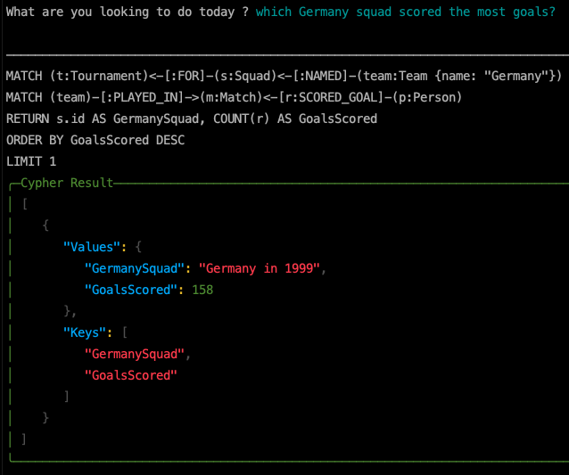

# This is your amazing submission for the SK Hackathon!

## Describe your plugin here
This plugin generates and executes neo4j cypher queries based on user prompt. 
The goal of this plugin is to enable querying knowledge graphs allowing complex using dynamic query generation which can provide business personnel
a chat based way to explore large data graphs

On initialization the specified neo4j database is queried to generate a text representation of the schema which is passed in the system message for any IChatCompletion Service

Usage
```cs
_plugin = new Neo4jPlugin(_Kernel, config["Neo4j:Url"], config["Neo4j:Username"], config["Neo4j:Password"]);

var result = await _plugin.Run(prompt);

System.Console.WriteLine(result.Cypher);
System.Console.WriteLine(JsonSerializer.Serialize(result.Result));
```

Bellow are execution snippets using gpt-3.5-turbo and women's World Cup 2019 Sample data set from neo4j






Full code with console sample app can be found [here](https://github.com/BLaZeKiLL/Codeblaze.SemanticKernel)

> This plugin is kinda crude, barely got time to work on it had a final exam, will refactor it and release is as nuget soon

### Contact Info
Share your contact info so the SK team and the community can get in touch

**Name: Devashish Lal**

**Email: devashis@usc.edu**